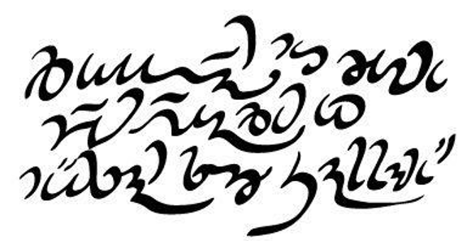

# 序言

本書寫給以創造語言爲愛好，想爲幻想作品或異世界創造語言之人。書中列舉創造「自然語言」之語言學方法，當然亦可以此反推創造「非自然語言」。對初識造語之人，本書可謂終南捷徑；對造語入門者，本書亦可豐富其造語知識。

上圖是我的人工語言（CONLANG）Verdurian 的例子。這段話可轉寫爲 **Ďitelán mu cum pén veaďen er mësan so Sannam**，意思是「在平和中前去愛並侍奉主（Go forth in peace to love and serve the Lord.）」字母 **Ď/ď** 發音同 *then* 中的 *th* 一樣（IPA：/ð/），母音發音與西班牙語類似。爲寫下如此題字，我需先完成以下工序（全爲本書涵蓋）：

- 定音系
- 造詞語
- 寫文法
- 畫文字
- 製手寫體
- 翻譯文本

上述步驟順序很重要。反道行之（如先翻譯文本再寫與之匹配的文法）將自相矛盾乃至無法進行。艾爾吉的 Syldavian 語是反面教材，他在造語時基本是隨編隨用，這使得我們無法依據《丁丁歷險記》中的語料來構造出合理一致的音韻或形態。

本書亦可用於間接瞭解語言學。因爲欲創造人工語言，必先對自然語言有充分瞭解。

## 致急性子

譬若機場售書的某些書廢話連篇，其作者僅是將文章的想法堆進書中。不似這種書，本書包含的大量材料能令你成爲造語行家。而我試圖將最重要的部分置於卷首篇內。如在首章講述創製用於地圖製作和命名的命名語言的全部知識。

你大可不必成爲全能專家，只需汲取自己所需。除非你的老師以此爲教材，此時你纔會在期末前狂補本書，試圖記住所有內容。

## 使用本書

### 整體結構 

本書以概覽開篇。下章將講述如何創造一個極爲基本的語言以命名事物。於此之後會展開創建更爲複雜的語言的過程。

本書主題囊闊一系列用以擴充文法的章節：音系、構詞、句法、語義學、語用學。在此之後會討論一些特殊主題：

- 創建語系
- 構建文字

我還附上了我的造語 Kebreni 的語法和註解。其語法本身就是一個範例，但我也提及了其中語源、選擇原因和現在的不同選擇。

在書末我附上了一些資料：基本詞表和參閱書目。

### 預備工作

造語對有些人來說很難，就如同作家寫作難產一樣。在閱讀本書時無需一次性應用到全部內容，但可以粗讀一遍來瞭解不同章節的內容以便在需要用時快速查找。

爲你的造語的文法寫好大綱（參見[[命名語言]]一章），然後可以通讀全書以遴選所需內容。這種選擇無需定式，無論是含噴音（ejectives）的語言還是聲調語言，是主賓謂語序或是擁有五個格都是可行的。造語就好似繪製紙片人，作者憑藉五官和形體的和諧而非堆積全新器官畫出好人設。

### 別看！

不！不要再往下看了。

簡言之，你不必把書直接讀完。當你閱讀新材料時，你或許只能吸收其中的一小部分，然後你就會感到頭暈目眩，再看不下其他內容了。但這並無大礙，你可以稍作休整後再看一邊，也可以試著讀一章，用一章，在閱讀完一章之後將文中的方法用到你自己的造語裏面。

### 爲何造語？ 

思考你的造語的用途。

- 命名人名地名：爲此目的僅需簡要的文法提綱和一個單詞表。
- 翻譯大小文本，或藝術性的造語——**藝術語言**（ARTLANG）：此時需完整的文法，其長度取決於語言的完整程度。另外，翻譯文本是檢查缺乏文法的良方。
- **輔助語言**（AUXLANG）：創製此種語言的要點是簡單和易習得。
- 探索語言學假說（工化語言）：如創造一種單詞儘可能少的語言，或是以系統性方式組織詞語，抑或者純手勢語言。此類語言實驗無需拘泥於自然語言的約束，但瞭解自然語言的組成結構仍有用，並且您應該了解母語所固有的假設。

### 本書的書寫習慣 

本書提到的專業術語將用小型大寫字母（SMALL CAPS）拼寫（譯註：譯文以無標記漢語加註英文原文表示）。這代表著：

- 這個詞不是我編的，你可以放心大膽地在你的文法書裏用它。
- 你可以透過搜尋引擎査找該詞以獲取更多資訊。（若你在某個語言學家的文章和維基百科之間搜尋到了不同的資訊，請相信前者的描述。維基百科對基本語言術語的闡述並不差，但某些時候卻可能產生錯誤或誤導。)

本書以斜體（*Italics*）表示單詞或短語。若該詞不是英語詞，我會爲該詞加上一個單引號（‘single quote’） （譯註：在中文版表示中文詞用「方引號」，表示其他詞用斜體）

例句會給出逐詞彙（GLOSS）翻譯和正常翻譯兩種譯文。我亦推薦你用此形式來寫文法，因爲它能讓你更清晰的觀察語言結構。以下是一個例子：

>**U menya i u nyevo nyet khlyeba. **
>
>by=一人稱.屬格=和=by=三人稱.屬格=不=麪包-屬格
>
>「我和他都沒有麪包」

連字符用於表示可分單詞的結構：如**khlyeb-** 表示「麪包」、**-a** 是單數屬格後綴。句點用於表示不可分單詞的邏輯結構，譬如 **menya** 是第一人稱單數屬格代名詞，而它不可被分。

當本書談及語音學時：

- **粗體**表示字母或字音
- / / 斜線表示寬式音標（基於音位的音標）
- \[ ] 方括號表示嚴式音標（基於音値的音標）
- ※米星用於給出提示、警告、豆知識或額外的閱讀指南。

### 造語之道

許多萌新造語者常常會走上一條相似的道路：

 - 起初——此時他們對其他語言一無所知——他们選擇改革母語。或許只是對母語做一點簡單的修改，比如爲字賦予新讀音或創造新文字寫法。有的造語者可能會創造了一種所謂「精靈語」或「矮人語」的垃圾幻想語言。
 - 過一段時間，依個人愛好的不同，他們「重新發明」了世界語（Esperanto）或是創造一種「新」的羅曼語（Romance language）。
 - 在瞭解了語言學的皮毛之後，他們便開始創造「大雜燴」語——一種包含他們所知全部語言特徵的語言。

你無需爲此擔憂，這是造語之路上的必由處。但顯然你的長期付出會提高你的造語水平。所以與其讓你的初造語作爲你幻想世界的通語，倒不如在它的祖語或親族語言上作出改進。我本人就希望自己能如此造語。我最著名也是最發展的語言是 Verdurian，但我認為我後來的大多數造語都做得比它更好。

### 網路資源

網路世界很精彩，但連結卻常常失效。因而我不在此書中列舉網站，而是列舉一個單一的永久網址，並在此更新網路連結：http://www.zompist.com/resources/。

Kindle 用戶請注意，本書印刷版所附的國際音標表在 Kindle 中不可讀，但你可以在上述網頁找到該表。

### 鳴謝

感謝每個閱讀或推薦網路版 LCK 的人，特別是那些指出其中謬誤之處的人。我很抱歉當時沒有記名，但Ivan Derzhanski 令我記憶尤新，而 John Lawler 是早期的支援者。

感謝 Daniel von Brighoff 和 Jeff Burke 對本書的評論，感謝 Jeffrey Henning 和我妻子 Lida 推動本書完稿。感謝 ZBB 上的每一個人，是他們讓造語這座孤島化作了一個大陸。

Mark Rosenfelder 於二〇一〇三月
